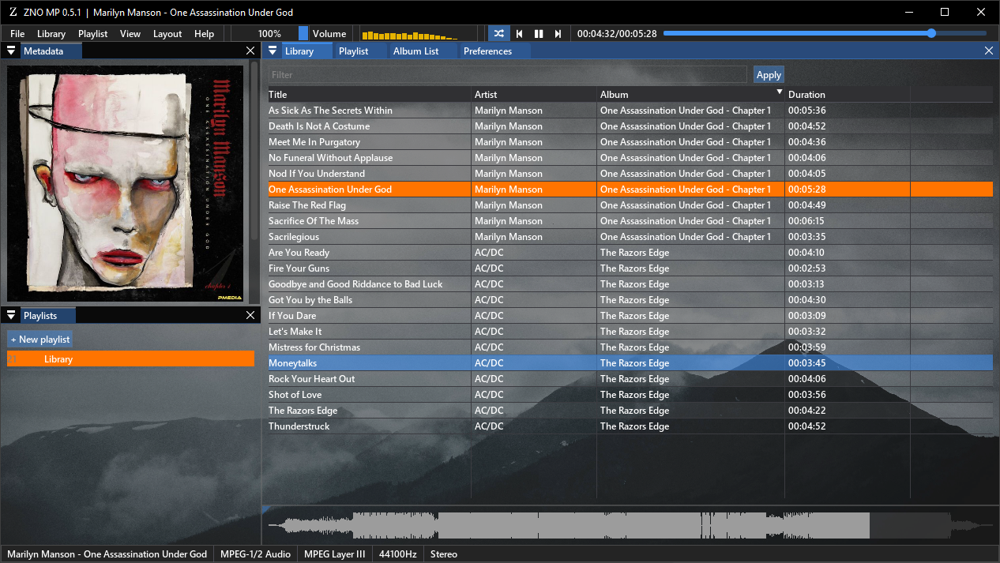
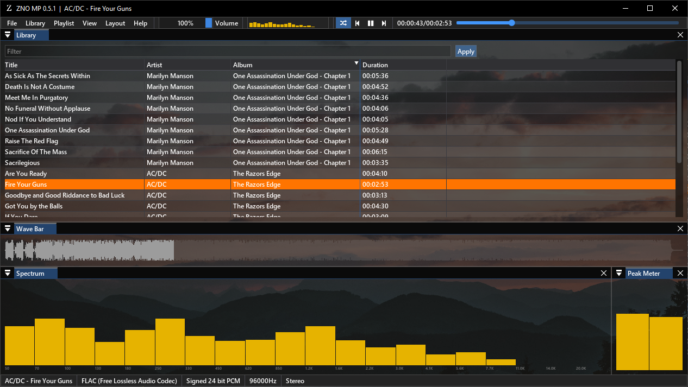

### ZNO Music Player
Lightweight music player for Windows using ImGui. Inspired by Foobar2000.

### Screenhots

### Building
Build using CMake with vcpkg. Requires packages:
- freetype
- sndfile
- samplerate
- taglib
- kissfft
